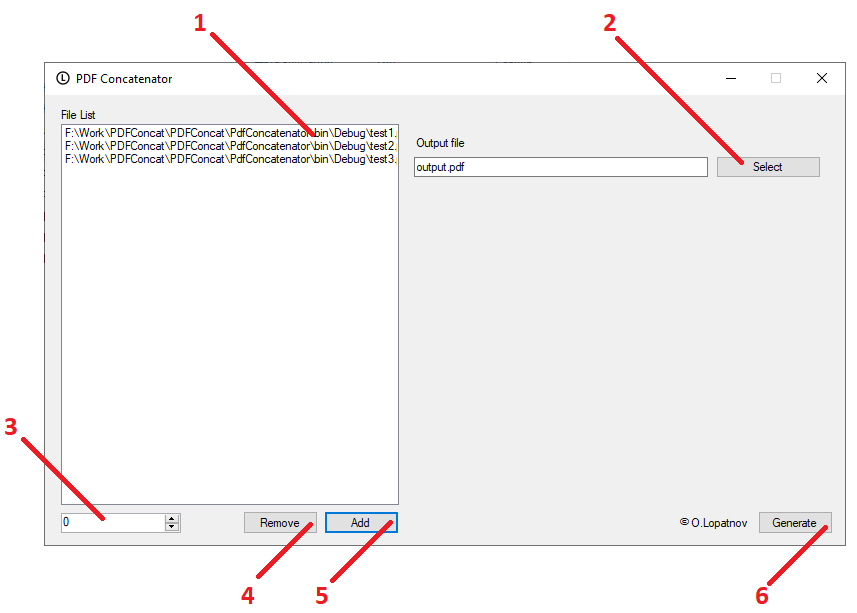

# PDF concatenator

This software concatenate pdf files.

1. The list of pdf files

2. The name / path of generated (concatenated) file

3. Position number in list

4. Remove pdf file from list

5. Add pdf file to list

6. Generate concatenated file

Download [pdf-concatenator 1.0 for Windows](https://github.com/lopatnov/pdf-concatenator/releases/tag/1.0) link: https://github.com/lopatnov/pdf-concatenator/releases/tag/1.0

